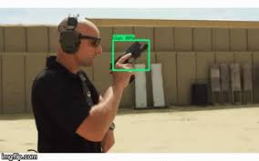
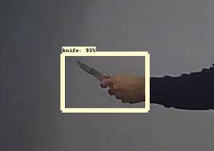

# Object_Detection_final_year_Project
Final year project made using transfer learning(Deep Learning) to detect and classify objects present in images.

This project was made in my final year of undergraduation.

This project uses Deep Learning implemented with Convolutional Neural Networks Architecture on images and then classifies into classes.

https://drive.google.com/drive/folders/1magBWZ9UYdASis7EFF-sOELG29a3_rUo?usp=sharing

.jpg)

